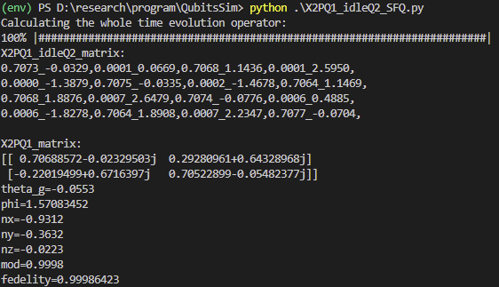
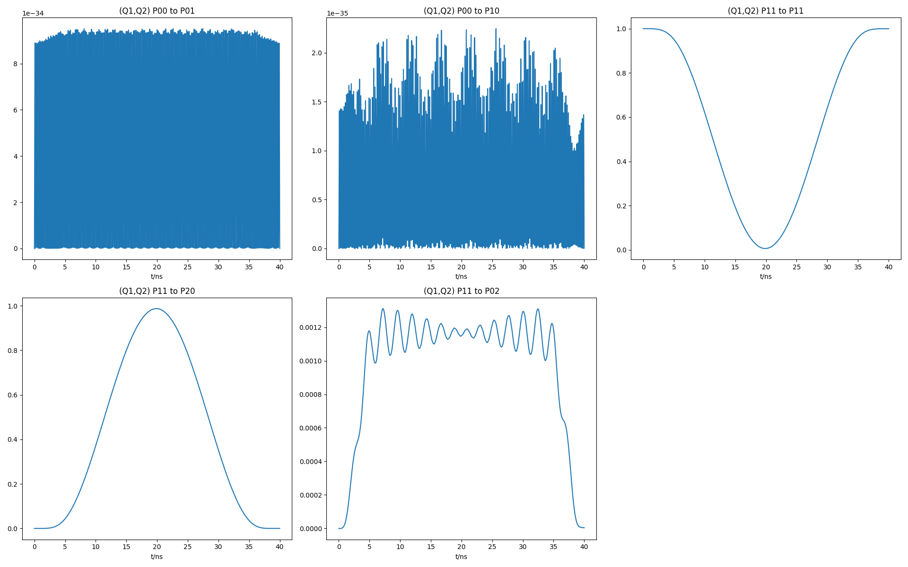

# Result
## XP2Q1_idleQ2 SFQ_1

## XP2Q1_idleQ2 SFQ_2

## XP2Q1_idleQ2 SFQ_3

## XP2Q1_idleQ2 SFQ_4

## XP2Q1_idleQ2 SFQ_5

## XP2Q1_idleQ2 SFQ_6

## XP2Q1_idleQ2 SFQ_7

## XP2Q1_idleQ2 SFQ_8

## XP2Q1_idleQ2 SFQ_9

## XP2Q1_idleQ2 SFQ_10

## ACCZ

## DCCZ

